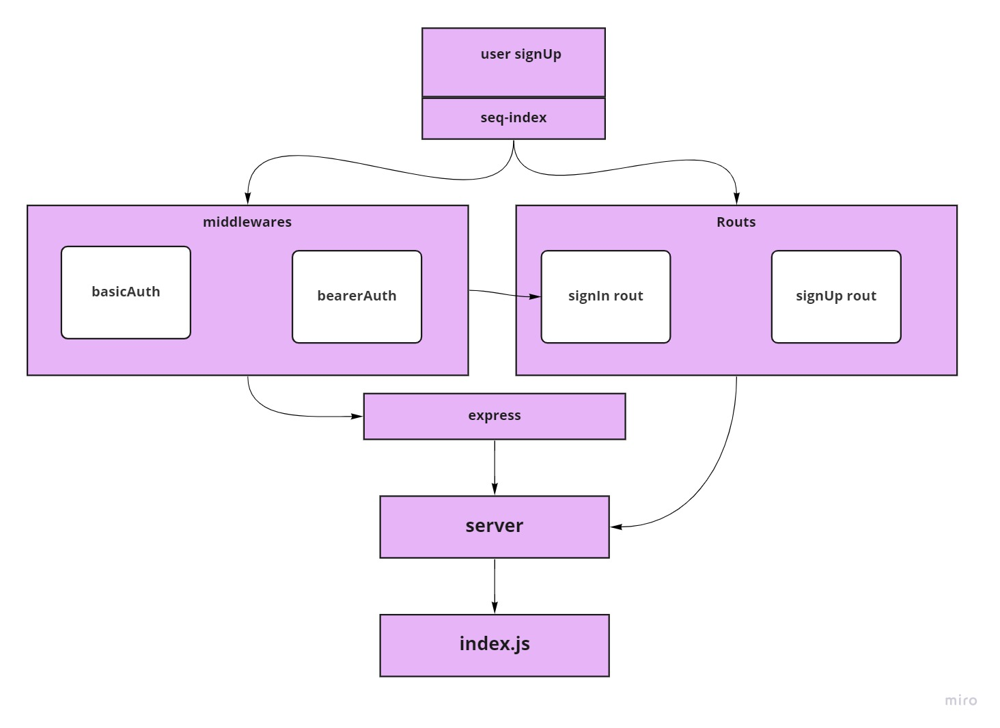

# bearer-auth
Authentication Server Phase 2: Token (Bearer) Authentication  At this point, our auth-server is able to allow a user to create an account as well as to handle Basic Authentication (user provides a username + password). When a “good” login happens, the user is considered to be “authenticated” and our auth-server generates a JWT signed “Token” which is returned to the application  We will now be using that Token to re-authenticate users to shield access to any route that requires a valid login to access.

# UmL

### pull requist
[pull requist](https://github.com/MarahAlrefaai/bearer-auth/pull/3)
---
### action 
[action](https://github.com/MarahAlrefaai/bearer-auth/actions)
---
### heroku 
[heroku](https://marah-bearerauth-adv.herokuapp.com/)
---
